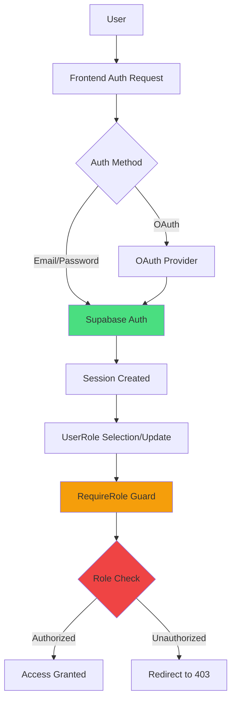
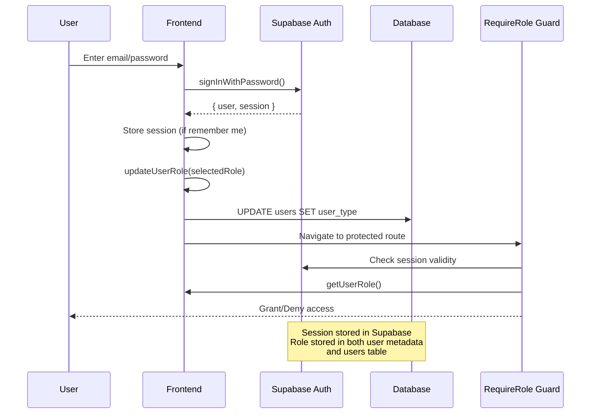
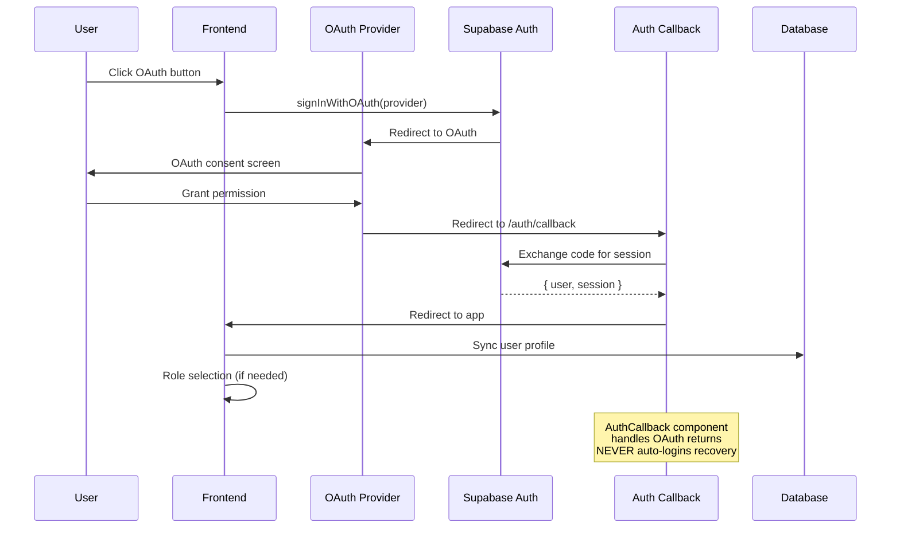
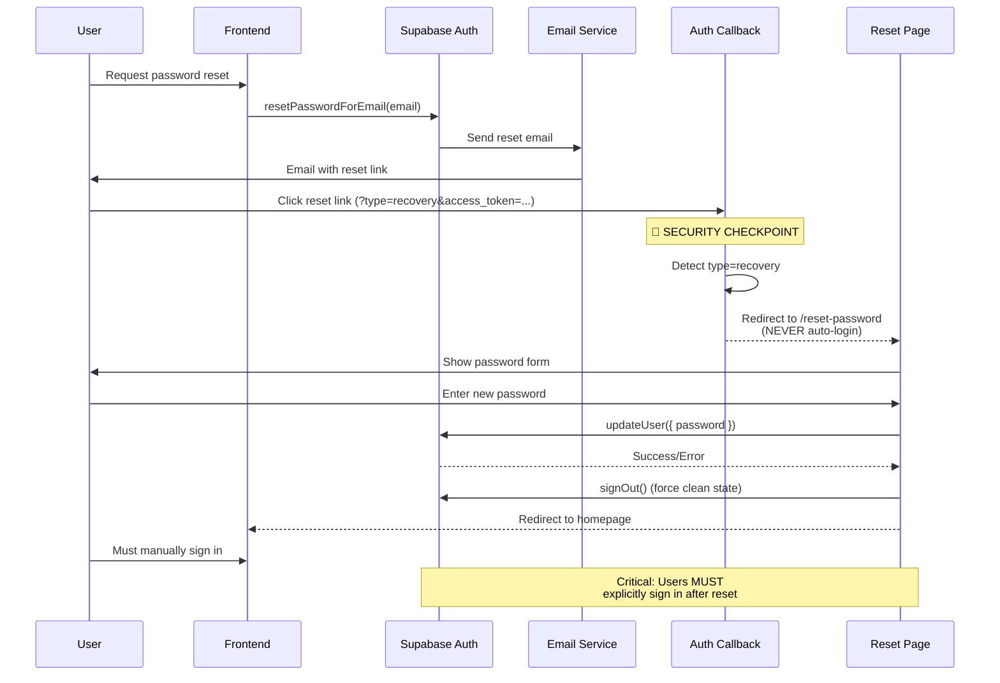
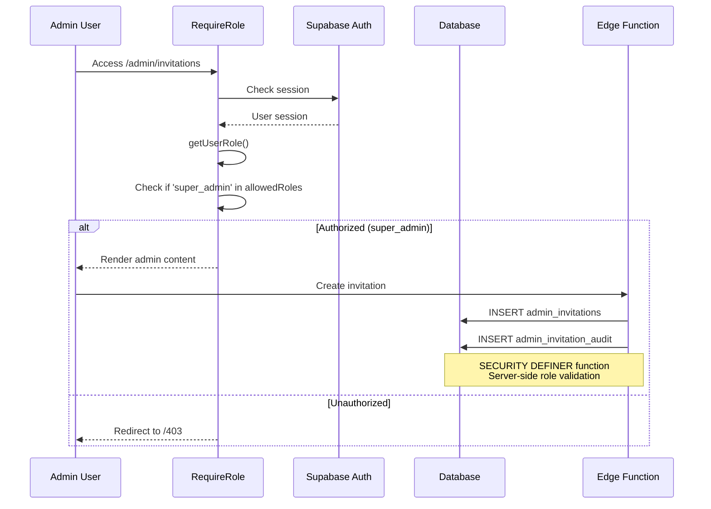
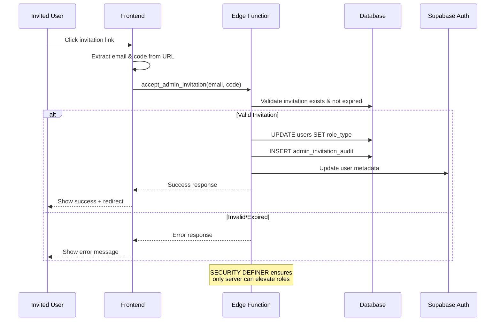

# Supabase Authentication Flow Diagrams

## Overview
This document provides visual diagrams and explanations for all authentication flows in the BelizeVibes application, helping developers understand the security model and implementation patterns.

## 🔐 Core Authentication Architecture



## 1. 🔑 Email/Password Sign-In Flow



## 2. 🔄 OAuth Sign-In Flow (Google/Apple/Instagram)



## 3. 🔒 Password Reset Flow (CRITICAL SECURITY)



## 4. 👥 Role-Based Access Control

```mermaid
graph TB
    A[Route Request] --> B[RequireRole Component]
    B --> C{User Authenticated?}
    C -->|No| D[Redirect to 403]
    C -->|Yes| E[Get User Role]
    E --> F{Role in allowedRoles?}
    F -->|No| D
    F -->|Yes| G[Render Protected Content]
    
    H[Role Sources] --> I[getUserRole()]
    I --> J[user.user_metadata.role]
    I --> K[user.user_metadata.user_type]
    I --> L[Fallback to null]
    
    style B fill:#3b82f6
    style F fill:#f59e0b
    style G fill:#10b981
    style D fill:#ef4444
```

## 5. 🔐 Admin Portal Security Flow



## 6. 📧 Admin Invitation Acceptance Flow



## 🛡️ Security Principles

### 1. **Session Management**
- Sessions stored securely in Supabase
- "Remember me" uses localStorage for convenience
- All auth state changes trigger re-validation

### 2. **Role Elevation** 
- **CLIENT NEVER ELEVATES ROLES**
- Only SECURITY DEFINER functions can change user roles
- All role changes are audited

### 3. **Password Reset Security**
- Recovery links NEVER auto-login users
- Users must explicitly set new password
- Forced sign-out after password change

### 4. **Route Protection**
- RequireRole component guards all admin routes
- Multiple roles can be specified per route
- Graceful fallback to 403 page

## 🔧 Implementation Files

| Component | File Path | Purpose |
|-----------|-----------|---------|
| AuthProvider | `src/components/auth/AuthProvider.tsx` | Core auth context |
| RequireRole | `src/components/auth/RequireRole.tsx` | Route protection |
| AuthCallback | `src/pages/auth/callback.tsx` | OAuth & recovery handling |
| ResetPassword | `src/pages/ResetPassword.tsx` | Secure password reset |
| SignInModal | `src/components/auth/SignInModal.tsx` | Email/OAuth sign-in |

## 🚨 Critical Security Notes

1. **Never modify auth flows without security review**
2. **All role changes must use SECURITY DEFINER functions**
3. **Password reset must never auto-login users**
4. **Test auth flows thoroughly in production-like environment**
5. **Monitor auth logs for suspicious activity**

## 📋 Testing Checklist

- [ ] Password reset requires explicit password entry
- [ ] Recovery links don't auto-login
- [ ] Admin routes reject non-admin users
- [ ] Role changes are properly audited
- [ ] OAuth flows complete successfully
- [ ] Session persistence works correctly