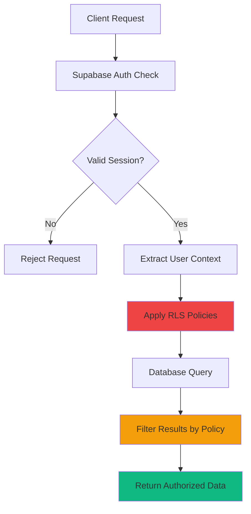

# Row Level Security (RLS) Policies Guide

## Overview
This document explains Supabase Row Level Security (RLS) policies implementation in BelizeVibes, providing clear explanations for developers to understand, maintain, and extend our security model.

## 🔒 What is RLS?

Row Level Security (RLS) is PostgreSQL's way of controlling which rows users can see and modify at the **database level**. Unlike application-level security, RLS policies are enforced by the database engine itself.

```sql
-- Example: Users can only see their own bookings
CREATE POLICY "Users can view own bookings" ON bookings
    FOR SELECT USING (user_id = auth.uid());
```

## 🏗️ RLS Architecture in BelizeVibes



## 📊 Table-by-Table RLS Policies

### 1. 👤 Users Table

```sql
-- Enable RLS
ALTER TABLE users ENABLE ROW LEVEL SECURITY;

-- Policy: Users can view their own profile
CREATE POLICY "Users can view own profile" ON users
    FOR SELECT USING (id = auth.uid());

-- Policy: Users can update their own profile  
CREATE POLICY "Users can update own profile" ON users
    FOR UPDATE USING (id = auth.uid());

-- Policy: Super admins can view all users
CREATE POLICY "Super admins can view all users" ON users
    FOR SELECT USING (
        EXISTS (
            SELECT 1 FROM users 
            WHERE id = auth.uid() 
            AND user_type = 'super_admin'
        )
    );
```

**Purpose**: Ensures users can only access their own data, while super admins have full visibility.

### 2. 🎯 Tours Table (Canonical Source)

```sql
ALTER TABLE tours ENABLE ROW LEVEL SECURITY;

-- Policy: Anyone can view published tours
CREATE POLICY "Anyone can view published tours" ON tours
    FOR SELECT USING (status = 'published');

-- Policy: Guides can view their own tours
CREATE POLICY "Guides can view own tours" ON tours
    FOR SELECT USING (guide_id = auth.uid());

-- Policy: Guides can update their own tours
CREATE POLICY "Guides can update own tours" ON tours
    FOR UPDATE USING (guide_id = auth.uid());

-- Policy: Admins can manage all tours
CREATE POLICY "Admins can manage all tours" ON tours
    FOR ALL USING (
        EXISTS (
            SELECT 1 FROM users 
            WHERE id = auth.uid() 
            AND user_type IN ('admin', 'super_admin')
        )
    );
```

**Purpose**: Public can see published tours, guides manage their own, admins have full control.

### 3. 📅 Bookings Table

```sql
ALTER TABLE bookings ENABLE ROW LEVEL SECURITY;

-- Policy: Users can view their own bookings
CREATE POLICY "Users can view own bookings" ON bookings
    FOR SELECT USING (user_id = auth.uid());

-- Policy: Guides can view bookings for their tours
CREATE POLICY "Guides can view tour bookings" ON bookings
    FOR SELECT USING (
        EXISTS (
            SELECT 1 FROM tours 
            WHERE tours.id = bookings.tour_id 
            AND tours.guide_id = auth.uid()
        )
    );

-- Policy: Users can create their own bookings
CREATE POLICY "Users can create own bookings" ON bookings
    FOR INSERT WITH CHECK (user_id = auth.uid());

-- Policy: Admins can view all bookings
CREATE POLICY "Admins can view all bookings" ON bookings
    FOR SELECT USING (
        EXISTS (
            SELECT 1 FROM users 
            WHERE id = auth.uid() 
            AND user_type IN ('admin', 'super_admin')
        )
    );
```

**Purpose**: Users see their bookings, guides see bookings for their tours, admins see everything.

### 4. 📧 Admin Invitations Table

```sql
ALTER TABLE admin_invitations ENABLE ROW LEVEL SECURITY;

-- Policy: Only super admins can view invitations
CREATE POLICY "Super admins can view invitations" ON admin_invitations
    FOR SELECT USING (
        EXISTS (
            SELECT 1 FROM users 
            WHERE id = auth.uid() 
            AND user_type = 'super_admin'
        )
    );

-- Policy: Only super admins can create invitations
CREATE POLICY "Super admins can create invitations" ON admin_invitations
    FOR INSERT WITH CHECK (
        EXISTS (
            SELECT 1 FROM users 
            WHERE id = auth.uid() 
            AND user_type = 'super_admin'
        )
    );

-- Policy: Anyone can view their own invitation (for acceptance)
CREATE POLICY "Users can view own invitation" ON admin_invitations
    FOR SELECT USING (email = auth.email());
```

**Purpose**: Restricts invitation management to super admins, but allows invited users to see their invitation.

### 5. 📝 Admin Invitation Audit Table

```sql
ALTER TABLE admin_invitation_audit ENABLE ROW LEVEL SECURITY;

-- Policy: Only super admins can view audit logs
CREATE POLICY "Super admins can view audit logs" ON admin_invitation_audit
    FOR SELECT USING (
        EXISTS (
            SELECT 1 FROM users 
            WHERE id = auth.uid() 
            AND user_type = 'super_admin'
        )
    );
```

**Purpose**: Audit trail is only visible to super admins for security monitoring.

## 🔍 Understanding Policy Syntax

### Basic Policy Structure
```sql
CREATE POLICY "policy_name" ON table_name
    FOR operation         -- SELECT, INSERT, UPDATE, DELETE, ALL
    USING (condition)     -- When can they see rows?
    WITH CHECK (condition) -- What can they insert/update?
```

### Common Patterns

#### 1. **Owner-Only Access**
```sql
USING (user_id = auth.uid())
```
**Meaning**: User can only access rows where they are the owner.

#### 2. **Role-Based Access**
```sql
USING (
    EXISTS (
        SELECT 1 FROM users 
        WHERE id = auth.uid() 
        AND user_type = 'admin'
    )
)
```
**Meaning**: Only users with 'admin' role can access these rows.

#### 3. **Relationship-Based Access**
```sql
USING (
    EXISTS (
        SELECT 1 FROM tours 
        WHERE tours.id = bookings.tour_id 
        AND tours.guide_id = auth.uid()
    )
)
```
**Meaning**: Users can access bookings only if they own the related tour.

#### 4. **Public Read, Owner Write**
```sql
-- For SELECT
FOR SELECT USING (status = 'published');

-- For UPDATE  
FOR UPDATE USING (guide_id = auth.uid());
```
**Meaning**: Anyone can read published content, only owner can modify.

## 🚨 Security Anti-Patterns to Avoid

### ❌ **Never Do This:**
```sql
-- DON'T: Client-side role checking only
if (user.role === 'admin') {
    // Show admin content
}

-- DON'T: Trusting client-sent user IDs
await supabase
    .from('bookings')
    .select('*')
    .eq('user_id', clientSentUserId); // 🚨 DANGEROUS
```

### ✅ **Always Do This:**
```sql
-- DO: Let RLS handle authorization
await supabase
    .from('bookings')
    .select('*'); // RLS automatically filters to user's bookings

-- DO: Use auth.uid() in policies
USING (user_id = auth.uid()) -- Database validates user
```

## 🔧 Testing RLS Policies

### 1. **Manual Testing in Supabase Dashboard**
```sql
-- Test as specific user
SELECT set_config('request.jwt.claim.sub', 'user-uuid-here', TRUE);

-- Run query to see what they can access
SELECT * FROM bookings;
```

### 2. **Automated RLS Tests**
```sql
-- Test function example
CREATE OR REPLACE FUNCTION test_user_can_only_see_own_bookings()
RETURNS VOID AS $$
DECLARE
    user1_id UUID := 'test-user-1';
    user2_id UUID := 'test-user-2';
    booking_count INTEGER;
BEGIN
    -- Set session as user1
    PERFORM set_config('request.jwt.claim.sub', user1_id::TEXT, TRUE);
    
    -- Count visible bookings
    SELECT COUNT(*) INTO booking_count FROM bookings;
    
    -- Assert only user1's bookings are visible
    ASSERT booking_count = (
        SELECT COUNT(*) FROM bookings WHERE user_id = user1_id
    ), 'User should only see own bookings';
END;
$$ LANGUAGE plpgsql;
```

## 🎯 Common RLS Debugging

### Problem: "No rows returned when they should be"
```sql
-- Check if RLS is enabled
SELECT schemaname, tablename, rowsecurity 
FROM pg_tables 
WHERE tablename = 'your_table';

-- Check current user context
SELECT auth.uid(), auth.email();

-- List all policies on table
SELECT schemaname, tablename, policyname, permissive, roles, cmd, qual
FROM pg_policies 
WHERE tablename = 'your_table';
```

### Problem: "Users seeing too much data"
```sql
-- Test policy in isolation
SELECT * FROM your_table WHERE (your_policy_condition);

-- Check for conflicting policies
-- Multiple PERMISSIVE policies are OR'd together
-- RESTRICTIVE policies are AND'd together
```

## 🔐 Security Best Practices

### 1. **Principle of Least Privilege**
- Start with restrictive policies
- Only grant access that's absolutely necessary
- Regularly audit and review policies

### 2. **Defense in Depth**
- RLS is your **last line of defense**
- Still validate on the frontend for UX
- Use TypeScript for additional safety

### 3. **Audit Trail**
- Log all sensitive operations
- Monitor policy violations
- Alert on suspicious access patterns

### 4. **Testing Strategy**
```javascript
// Frontend integration test
test('user can only see own bookings', async () => {
    const { data } = await supabase.from('bookings').select('*');
    
    // All returned bookings should belong to current user
    data.forEach(booking => {
        expect(booking.user_id).toBe(currentUser.id);
    });
});
```

## 📚 Reference Links

- [PostgreSQL RLS Documentation](https://www.postgresql.org/docs/current/ddl-rowsecurity.html)
- [Supabase RLS Guide](https://supabase.com/docs/guides/auth/row-level-security)
- [BelizeVibes Security Architecture](./supabase-auth-flows.md)

## 🆘 Emergency RLS Disable (Production Only)

```sql
-- ONLY in true emergency - disables all RLS
ALTER TABLE table_name DISABLE ROW LEVEL SECURITY;

-- Re-enable immediately after fix
ALTER TABLE table_name ENABLE ROW LEVEL SECURITY;
```

**⚠️ Warning**: Disabling RLS exposes ALL data. Only use in critical emergencies with immediate re-enablement plan.