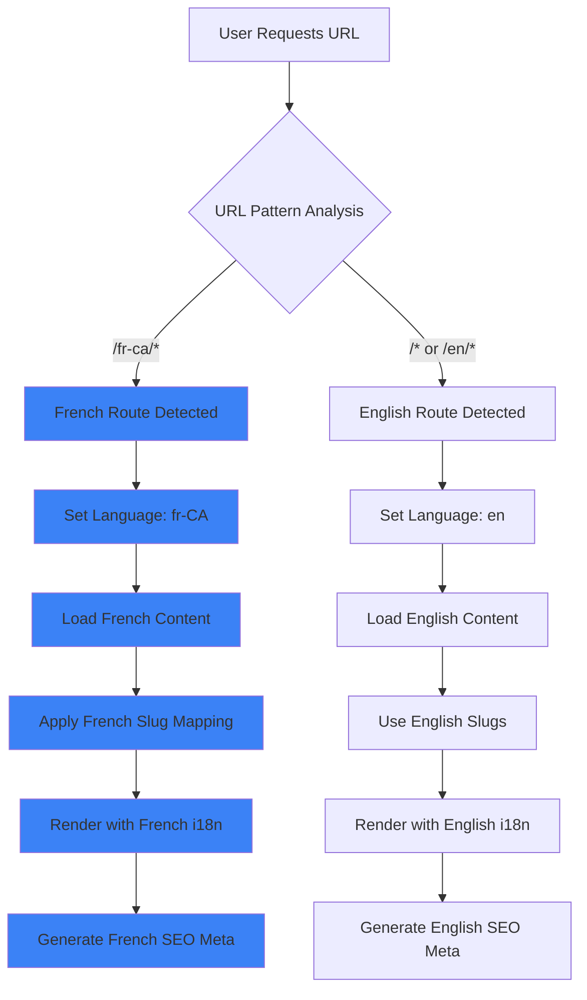
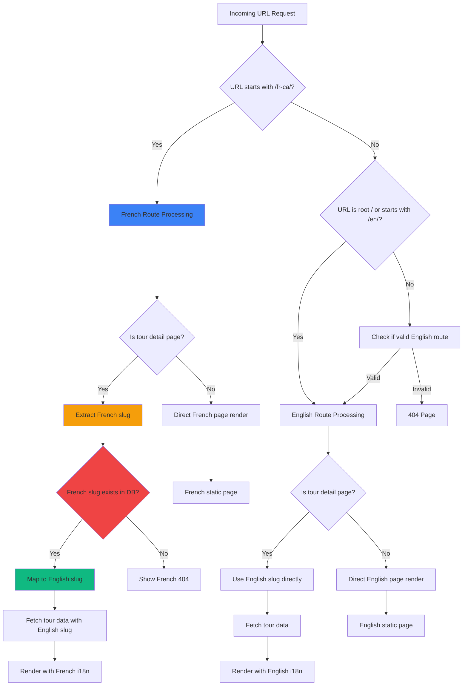
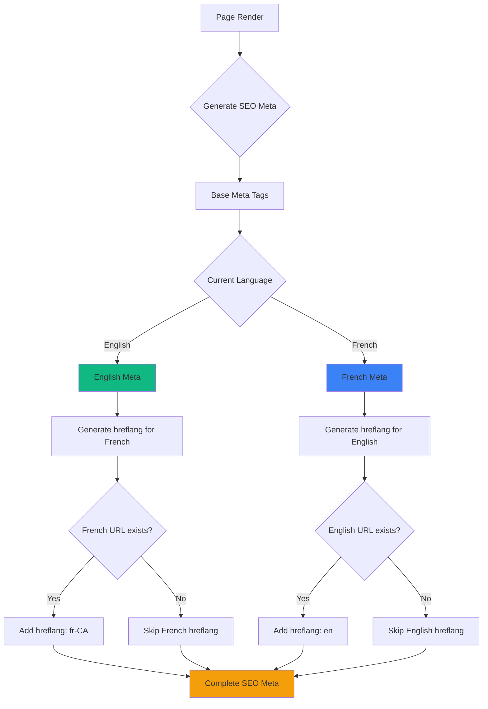

# i18n Routing Decision Tree Guide

## Overview
This guide provides a clear decision tree for implementing and understanding the bilingual routing system in BelizeVibes, helping developers navigate language detection, URL patterns, and SEO considerations.

## 🌐 Routing Architecture Overview



## 🗺️ URL Pattern Decision Tree



## 🔀 Route Mapping Table

| Page Type | English URL | French URL | Notes |
|-----------|-------------|------------|-------|
| **Homepage** | `/` | `/fr-ca` | Root redirects based on browser lang |
| **Tours Listing** | `/tours` | `/fr-ca/tours` | Same data, different language |
| **Tour Detail** | `/tours/{english-slug}` | `/fr-ca/tours/{french-slug}` | Slug mapping required |
| **About** | `/about` | `/fr-ca/a-propos` | Static page translation |
| **Safety** | `/safety` | `/fr-ca/securite` | Static page translation |
| **Contact** | `/contact` | `/fr-ca/contact` | Form labels translated |
| **Blog** | `/blog/{english-slug}` | `/fr-ca/blog/{french-slug}` | Content + slug translation |

## 🧠 Language Detection Logic

```mermaid
flowchart TD
    A[User visits site] --> B{URL contains /fr-ca/?}
    
    B -->|Yes| C[Set language: fr-CA]
    B -->|No| D{Browser language preference?}
    
    D -->|fr, fr-CA, fr-*| E{User has language preference stored?}
    D -->|en, en-*, other| F[Set language: en]
    
    E -->|Stored: French| C
    E -->|Stored: English| F
    E -->|No preference| G[First-time French visitor decision]
    
    G --> H{Geo-location suggests French?}
    H -->|Yes (Canada, France, etc.)| I[Suggest French - show banner]
    H -->|No| F
    
    I --> J{User accepts French?}
    J -->|Yes| K[Redirect to /fr-ca/ + store preference]
    J -->|No| L[Stay English + store preference]
    
    C --> M[Load French translations]
    F --> N[Load English translations]
    L --> N
    K --> M
    
    style C fill:#3b82f6
    style K fill:#3b82f6
    style M fill:#3b82f6
```

## 🔧 Implementation Decision Points

### 1. **Route Registration**

```typescript
// App.tsx - Route Decision Logic
function App() {
  return (
    <Router>
      <Routes>
        {/* English Routes (default) */}
        <Route path="/" element={<HomePage />} />
        <Route path="/tours" element={<ToursPage />} />
        <Route path="/tours/:slug" element={<TourDetailPage />} />
        <Route path="/about" element={<AboutPage />} />
        
        {/* French Routes */}
        <Route path="/fr-ca" element={<HomePage />} />
        <Route path="/fr-ca/tours" element={<ToursPage />} />
        <Route path="/fr-ca/tours/:slug" element={<TourDetailPage />} />
        <Route path="/fr-ca/a-propos" element={<AboutPage />} />
        
        <Route path="*" element={<NotFoundPage />} />
      </Routes>
    </Router>
  );
}
```

### 2. **Language Context Hook**

```typescript
// hooks/useLanguageContext.ts - Decision Implementation
export const useLanguageContext = () => {
  const location = useLocation();
  
  // Decision: Determine language from URL
  const language = useMemo(() => {
    if (location.pathname.startsWith('/fr-ca')) {
      return 'fr-CA';
    }
    return 'en';
  }, [location.pathname]);
  
  // Decision: Get appropriate slug for current language
  const getSlugForLanguage = (englishSlug: string, frenchSlug?: string) => {
    if (language === 'fr-CA' && frenchSlug) {
      return frenchSlug;
    }
    return englishSlug;
  };
  
  // Decision: Generate URL for other language
  const getAlternateLanguageUrl = (currentPath: string) => {
    if (language === 'fr-CA') {
      // Remove /fr-ca prefix for English
      return currentPath.replace(/^\/fr-ca/, '') || '/';
    } else {
      // Add /fr-ca prefix for French
      return `/fr-ca${currentPath}`;
    }
  };
  
  return {
    language,
    isEnglish: language === 'en',
    isFrench: language === 'fr-CA',
    getSlugForLanguage,
    getAlternateLanguageUrl
  };
};
```

### 3. **Slug Mapping Logic**

```typescript
// utils/frenchSlugs.ts - Slug Decision Tree
export const frenchSlugMapping: Record<string, string> = {
  // Tours
  'cave-tubing-adventure': 'aventure-tubing-caverne',
  'jungle-zip-lining': 'tyrolienne-jungle',
  'reef-snorkeling': 'plongee-recif',
  'mayan-ruins-tour': 'visite-ruines-maya',
  
  // Blog posts
  'ultimate-belize-guide': 'guide-ultime-belize',
  'best-snorkeling-spots': 'meilleurs-spots-plongee',
};

export const getEnglishSlugFromFrench = (frenchSlug: string): string | null => {
  // Decision: Find English equivalent of French slug
  const entry = Object.entries(frenchSlugMapping).find(
    ([, french]) => french === frenchSlug
  );
  return entry ? entry[0] : null;
};

export const getFrenchSlugFromEnglish = (englishSlug: string): string | null => {
  // Decision: Find French equivalent of English slug
  return frenchSlugMapping[englishSlug] || null;
};
```

### 4. **Tour Detail Page Logic**

```typescript
// pages/AdventureDetail.tsx - Route Parameter Decision
export const AdventureDetail = () => {
  const { slug } = useParams<{ slug: string }>();
  const { language, isEnglish } = useLanguageContext();
  
  // Decision: Determine which slug to use for data fetching
  const dataSlug = useMemo(() => {
    if (isEnglish) {
      // English route: use slug directly
      return slug;
    } else {
      // French route: map French slug to English for data fetching
      const englishSlug = getEnglishSlugFromFrench(slug!);
      if (!englishSlug) {
        // Decision: French slug not found
        throw new Error('Tour not found');
      }
      return englishSlug;
    }
  }, [slug, isEnglish]);
  
  // Fetch data using English slug (canonical source)
  const { data: tour, error } = useTour(dataSlug);
  
  // Decision: Show 404 if tour not found
  if (error || !tour) {
    return <NotFoundPage />;
  }
  
  return <TourContent tour={tour} language={language} />;
};
```

## 🎯 SEO Decision Matrix



### SEO Implementation
```typescript
// components/SEO/GlobalMeta.tsx
export const GlobalMeta = ({ tour }: { tour?: Tour }) => {
  const { language, getAlternateLanguageUrl } = useLanguageContext();
  const location = useLocation();
  
  // Decision: Generate appropriate meta tags for current language
  const metaTitle = language === 'fr-CA' 
    ? tour?.title_fr || tour?.title 
    : tour?.title;
    
  const metaDescription = language === 'fr-CA'
    ? tour?.description_fr || tour?.description
    : tour?.description;
  
  // Decision: Generate hreflang tags for alternate language
  const alternateUrl = getAlternateLanguageUrl(location.pathname);
  const hasAlternateVersion = tour?.slug_fr || isStaticPageWithTranslation(location.pathname);
  
  return (
    <Helmet>
      <title>{metaTitle}</title>
      <meta name="description" content={metaDescription} />
      
      {/* Self-referencing hreflang */}
      <link rel="alternate" hrefLang={language} href={window.location.href} />
      
      {/* Alternate language hreflang */}
      {hasAlternateVersion && (
        <link 
          rel="alternate" 
          hrefLang={language === 'fr-CA' ? 'en' : 'fr-CA'} 
          href={`${window.location.origin}${alternateUrl}`} 
        />
      )}
      
      {/* Default language */}
      <link rel="alternate" hrefLang="x-default" href={`${window.location.origin}/`} />
    </Helmet>
  );
};
```

## 🚨 Common Decision Pitfalls

### ❌ Don't Do This:
```typescript
// DON'T: Hard-code language logic
if (url.includes('fr')) {
  showFrench();
}

// DON'T: Mix slug types in same component
const slug = isFrench ? frenchSlug : englishSlug;
fetchTour(slug); // Data layer expects English slugs

// DON'T: Forget fallbacks
const title = tour.title_fr; // Might be undefined!
```

### ✅ Do This Instead:
```typescript
// DO: Use systematic language detection
const { language } = useLanguageContext();

// DO: Always use English slugs for data fetching
const dataSlug = getEnglishSlugFromFrench(frenchSlug) || englishSlug;
fetchTour(dataSlug);

// DO: Provide fallbacks
const title = language === 'fr-CA' 
  ? (tour.title_fr || tour.title) 
  : tour.title;
```

## 📊 Testing Decision Points

### Language Detection Tests
```typescript
describe('Language Detection', () => {
  test('detects French from /fr-ca/ URL', () => {
    renderWithRouter('/fr-ca/tours');
    expect(getCurrentLanguage()).toBe('fr-CA');
  });
  
  test('defaults to English for root URL', () => {
    renderWithRouter('/');
    expect(getCurrentLanguage()).toBe('en');
  });
});
```

### Slug Mapping Tests
```typescript
describe('Slug Mapping', () => {
  test('maps French slug to English for data fetching', () => {
    const englishSlug = getEnglishSlugFromFrench('aventure-tubing-caverne');
    expect(englishSlug).toBe('cave-tubing-adventure');
  });
  
  test('returns null for unknown French slug', () => {
    const englishSlug = getEnglishSlugFromFrench('unknown-slug');
    expect(englishSlug).toBeNull();
  });
});
```

### SEO Tests
```typescript
describe('SEO Meta Generation', () => {
  test('generates correct hreflang for bilingual pages', () => {
    renderTourPage('/tours/cave-tubing-adventure');
    
    expect(document.querySelector('link[hreflang="fr-CA"]')).toHaveAttribute(
      'href', 
      expect.stringContaining('/fr-ca/tours/aventure-tubing-caverne')
    );
  });
});
```

## 🔧 Implementation Checklist

### Route Setup
- [ ] English routes defined as default
- [ ] French routes with `/fr-ca` prefix
- [ ] Static page routes map to translated URLs
- [ ] 404 handling for missing translations

### Language Detection
- [ ] URL-based language detection implemented
- [ ] Browser language preference considered
- [ ] Language preference storage working
- [ ] Fallback to English for unsupported languages

### Slug Management
- [ ] French slug mapping table created
- [ ] Bidirectional slug conversion functions
- [ ] Database migration for `slug_fr` column
- [ ] Data fetching always uses English slugs

### SEO Implementation
- [ ] hreflang tags generated correctly
- [ ] Sitemap includes both language versions
- [ ] Meta tags translated appropriately
- [ ] Canonical URLs point to appropriate language

### Testing Coverage
- [ ] Language detection edge cases
- [ ] Slug mapping functionality
- [ ] SEO meta tag generation
- [ ] Route protection across languages

## 🔗 Related Documentation

- [Supabase Auth Flows](../auth/supabase-auth-flows.md)
- [Test Mocking Patterns](../testing/test-mocking-patterns.md)
- [CLAUDE.md Agent Definitions](../../CLAUDE.md)

## 🆘 Troubleshooting Guide

### Issue: Wrong language detected
**Check**: URL pattern matching in `useLanguageContext`

### Issue: French slug not found
**Check**: Slug mapping table and database `slug_fr` values

### Issue: SEO tags missing
**Check**: hreflang generation logic and alternate URL calculation

### Issue: 404 on valid French URLs
**Check**: Route registration and slug mapping functions