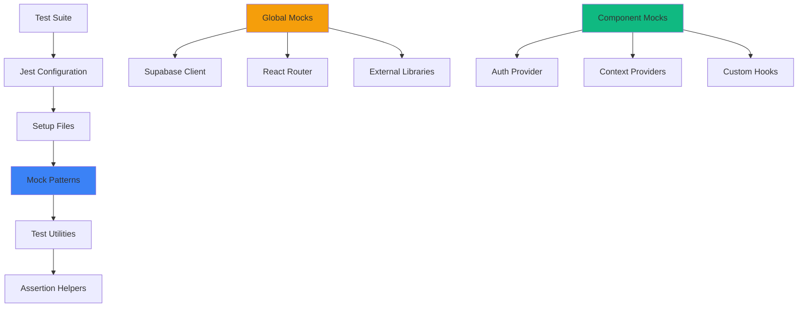

# Test Mocking Patterns Guide

## Overview
This guide provides proven patterns for mocking complex dependencies in the BelizeVibes application, helping developers write reliable, maintainable tests.

## 🏗️ Testing Architecture



## 🔧 Jest Configuration

### jest.config.js
```javascript
module.exports = {
  preset: 'ts-jest',
  testEnvironment: 'jsdom',
  setupFilesAfterEnv: ['<rootDir>/src/setupTests.ts'],
  moduleNameMapper: {
    '^@/(.*)$': '<rootDir>/src/$1',
    '\\.(css|less|scss|sass)$': 'identity-obj-proxy'
  },
  transform: {
    '^.+\\.(ts|tsx)$': ['ts-jest', {
      tsconfig: {
        jsx: 'react-jsx',
        esModuleInterop: true,
        allowSyntheticDefaultImports: true
      }
    }],
  },
  testPathIgnorePatterns: [
    '/node_modules/',
    '/src/__tests__/invitation.test.ts' // Temporarily disabled
  ]
};
```

### setupTests.ts (Global Setup)
```typescript
import '@testing-library/jest-dom';

// Mock react-router-dom for all tests
jest.mock('react-router-dom', () => ({
  ...jest.requireActual('react-router-dom'),
  BrowserRouter: ({ children }: { children: React.ReactNode }) => children,
  MemoryRouter: ({ children }: { children: React.ReactNode }) => children,
}));

// Mock Supabase client globally
jest.mock('@/integrations/supabase/client', () => ({
  supabase: {
    auth: {
      getSession: jest.fn().mockResolvedValue({ data: { session: null } }),
      onAuthStateChange: jest.fn().mockReturnValue({ 
        data: { subscription: { unsubscribe: jest.fn() } } 
      }),
      signInWithPassword: jest.fn(),
      signUp: jest.fn(),
      signOut: jest.fn(),
      signInWithOAuth: jest.fn(),
      resetPasswordForEmail: jest.fn(),
      updateUser: jest.fn(),
      resend: jest.fn(),
    },
    from: jest.fn().mockReturnValue({
      select: jest.fn().mockReturnValue({
        eq: jest.fn().mockResolvedValue({ data: [], error: null })
      }),
      update: jest.fn().mockReturnValue({
        eq: jest.fn().mockResolvedValue({ data: [], error: null })
      }),
      upsert: jest.fn().mockResolvedValue({ data: [], error: null })
    })
  }
}));
```

## 🎭 Core Mocking Patterns

### 1. 🔐 AuthProvider Mock Pattern

```typescript
// Pattern: Flexible AuthProvider mock
const createMockAuthProvider = (userProps = {}) => {
  const MockAuthProvider = ({ children }: { children: React.ReactNode }) => {
    const mockUser = userProps ? {
      id: '123',
      email: 'test@example.com',
      user_type: 'traveler',
      ...userProps
    } : null;

    const mockContextValue = {
      user: mockUser,
      loading: false,
      signIn: jest.fn(),
      signUp: jest.fn(),
      signOut: jest.fn(),
      resetPassword: jest.fn(),
      updatePassword: jest.fn(),
      getUserRole: jest.fn().mockReturnValue(mockUser?.user_type || null),
      updateUserRole: jest.fn(),
      isDeviceIOS: jest.fn().mockReturnValue(false),
      // ... other methods
    };

    return React.createElement(
      AuthContext.Provider,
      { value: mockContextValue },
      children
    );
  };

  return MockAuthProvider;
};

// Usage in tests
describe('RequireRole', () => {
  test('allows super admin access', () => {
    const MockAuthProvider = createMockAuthProvider({ 
      user_type: 'super_admin' 
    });

    render(
      <MockAuthProvider>
        <RequireRole allowedRoles={['super_admin']}>
          <div>Admin Content</div>
        </RequireRole>
      </MockAuthProvider>
    );

    expect(screen.getByText('Admin Content')).toBeInTheDocument();
  });
});
```

### 2. 🚀 React Router Mock Pattern

```typescript
// Pattern: Controlled navigation testing
const mockNavigate = jest.fn();

jest.mock('react-router-dom', () => ({
  ...jest.requireActual('react-router-dom'),
  useNavigate: () => mockNavigate,
  useSearchParams: () => [new URLSearchParams('type=recovery&access_token=abc123')],
  useLocation: () => ({ 
    pathname: '/auth/callback',
    search: '?type=recovery&access_token=abc123'
  }),
}));

// Test navigation behavior
test('redirects after password reset', async () => {
  // ... setup and user actions
  
  await waitFor(() => {
    expect(mockNavigate).toHaveBeenCalledWith('/', { replace: true });
  });
});
```

### 3. 📡 Supabase Client Mock Pattern

```typescript
// Pattern: Method-specific mocking
const mockSupabase = {
  auth: {
    updateUser: jest.fn(),
    signOut: jest.fn(),
    resetPasswordForEmail: jest.fn(),
  },
  from: jest.fn().mockReturnValue({
    select: jest.fn().mockReturnValue({
      eq: jest.fn(),
      order: jest.fn(),
      limit: jest.fn(),
    }),
    insert: jest.fn(),
    update: jest.fn().mockReturnValue({
      eq: jest.fn(),
    }),
    delete: jest.fn().mockReturnValue({
      eq: jest.fn(),
    }),
  }),
};

// Test-specific behavior
beforeEach(() => {
  jest.clearAllMocks();
  
  // Default successful responses
  mockSupabase.auth.updateUser.mockResolvedValue({ 
    data: { user: mockUser }, 
    error: null 
  });
  
  mockSupabase.auth.signOut.mockResolvedValue(undefined);
});

// Test error scenarios
test('handles password update error', async () => {
  mockSupabase.auth.updateUser.mockResolvedValue({
    data: null,
    error: { message: 'session_expired' }
  });

  // ... test implementation
  
  await waitFor(() => {
    expect(screen.getByText(/password reset link has expired/)).toBeInTheDocument();
  });
});
```

### 4. 🍞 Toast Mock Pattern

```typescript
// Pattern: Toast notification testing
const mockToast = {
  success: jest.fn(),
  error: jest.fn(),
  info: jest.fn(),
  warning: jest.fn(),
};

jest.mock('sonner', () => ({
  toast: mockToast,
}));

// Test toast calls
test('shows success toast after password reset', async () => {
  // ... setup and user actions
  
  await waitFor(() => {
    expect(mockToast.success).toHaveBeenCalledWith(
      'Password updated successfully! Please sign in with your new password.'
    );
  });
});
```

### 5. 🌐 i18n Mock Pattern

```typescript
// Pattern: Translation testing
const mockTranslation = (key: string) => key; // Return key as-is

jest.mock('react-i18next', () => ({
  useTranslation: () => ({
    t: mockTranslation,
    i18n: {
      language: 'en',
      changeLanguage: jest.fn(),
    }
  }),
  Trans: ({ children }: { children: React.ReactNode }) => children,
  I18nextProvider: ({ children }: { children: React.ReactNode }) => children,
}));

// Test with actual i18n if needed
import i18n from '@/lib/i18n';

const renderWithI18n = (component: React.ReactElement) => {
  return render(
    <I18nextProvider i18n={i18n}>
      {component}
    </I18nextProvider>
  );
};
```

## 🧪 Specific Test Patterns

### 1. 🔐 Authentication Flow Testing

```typescript
describe('Password Reset Flow', () => {
  const renderResetPassword = (urlParams = 'type=recovery&access_token=token123') => {
    return render(
      <MemoryRouter initialEntries={[`/reset-password?${urlParams}`]}>
        <AuthProvider>
          <ResetPassword />
        </AuthProvider>
      </MemoryRouter>
    );
  };

  test('validates token parameters', async () => {
    renderResetPassword('type=recovery'); // Missing access_token
    
    await waitFor(() => {
      expect(screen.getByText('Invalid Reset Link')).toBeInTheDocument();
    });
  });

  test('successful password update flow', async () => {
    mockSupabase.auth.updateUser.mockResolvedValue({ error: null });
    mockSupabase.auth.signOut.mockResolvedValue(undefined);
    
    renderResetPassword();
    
    // Wait for form to load
    await waitFor(() => {
      expect(screen.getByText('Set New Password')).toBeInTheDocument();
    });
    
    // Fill form
    fireEvent.change(screen.getByLabelText(/New Password/), {
      target: { value: 'StrongPassword123!' }
    });
    fireEvent.change(screen.getByLabelText(/Confirm New Password/), {
      target: { value: 'StrongPassword123!' }
    });
    
    // Submit
    fireEvent.click(screen.getByRole('button', { name: /Update Password/ }));
    
    // Verify calls
    await waitFor(() => {
      expect(mockSupabase.auth.updateUser).toHaveBeenCalledWith({
        password: 'StrongPassword123!'
      });
      expect(mockSupabase.auth.signOut).toHaveBeenCalled();
    });
  });
});
```

### 2. 🛡️ Route Protection Testing

```typescript
describe('RequireRole Component', () => {
  const RestrictedContent = () => <div>Restricted Content</div>;

  test('allows access for authorized roles', () => {
    const MockAuthProvider = createMockAuthProvider({
      user_type: 'super_admin'
    });

    render(
      <MemoryRouter>
        <MockAuthProvider>
          <RequireRole allowedRoles={['super_admin', 'admin']}>
            <RestrictedContent />
          </RequireRole>
        </MockAuthProvider>
      </MemoryRouter>
    );

    expect(screen.getByText('Restricted Content')).toBeInTheDocument();
  });

  test('redirects unauthorized users', () => {
    const MockAuthProvider = createMockAuthProvider({
      user_type: 'traveler'
    });

    render(
      <MemoryRouter>
        <MockAuthProvider>
          <RequireRole allowedRoles={['admin']}>
            <RestrictedContent />
          </RequireRole>
        </MockAuthProvider>
      </MemoryRouter>
    );

    expect(screen.queryByText('Restricted Content')).not.toBeInTheDocument();
  });
});
```

### 3. 🔄 Auth Callback Testing

```typescript
describe('AuthCallback Security', () => {
  test('prevents auto-login during recovery', async () => {
    const recoveryUrl = '/auth/callback?type=recovery&access_token=abc123';
    
    render(
      <MemoryRouter initialEntries={[recoveryUrl]}>
        <AuthCallback />
      </MemoryRouter>
    );

    await waitFor(() => {
      expect(mockNavigate).toHaveBeenCalledWith(
        '/reset-password?type=recovery&access_token=abc123',
        { replace: true }
      );
    });

    // Ensure no authentication occurred
    expect(mockToast.success).not.toHaveBeenCalledWith('Successfully signed in!');
  });

  test('handles normal auth callback', async () => {
    const MockAuthProvider = createMockAuthProvider({
      user_type: 'traveler'
    });

    render(
      <MemoryRouter initialEntries={['/auth/callback']}>
        <MockAuthProvider>
          <AuthCallback />
        </MockAuthProvider>
      </MemoryRouter>
    );

    await waitFor(() => {
      expect(mockNavigate).toHaveBeenCalledWith('/');
    }, { timeout: 2000 });
  });
});
```

## 🛠️ Testing Utilities

### Custom Render Helper
```typescript
// utils/test-utils.tsx
export const renderWithProviders = (
  ui: React.ReactElement,
  {
    initialEntries = ['/'],
    user = null,
    ...renderOptions
  } = {}
) => {
  const MockAuthProvider = createMockAuthProvider(user);
  
  const Wrapper = ({ children }: { children: React.ReactNode }) => (
    <MemoryRouter initialEntries={initialEntries}>
      <MockAuthProvider>
        <I18nextProvider i18n={i18n}>
          {children}
        </I18nextProvider>
      </MockAuthProvider>
    </MemoryRouter>
  );

  return render(ui, { wrapper: Wrapper, ...renderOptions });
};

// Usage
test('component with all providers', () => {
  renderWithProviders(
    <MyComponent />, 
    { 
      user: { user_type: 'admin' },
      initialEntries: ['/admin/dashboard']
    }
  );
});
```

### Async Helper
```typescript
export const waitForLoadingToFinish = () => {
  return waitFor(() => {
    expect(screen.queryByText('Loading...')).not.toBeInTheDocument();
  });
};

export const fillForm = async (fields: Record<string, string>) => {
  for (const [label, value] of Object.entries(fields)) {
    const input = screen.getByLabelText(new RegExp(label, 'i'));
    fireEvent.change(input, { target: { value } });
  }
};
```

## 🚨 Common Testing Pitfalls

### ❌ Don't Do This:
```typescript
// DON'T: Test implementation details
expect(wrapper.find('.password-input').prop('type')).toBe('password');

// DON'T: Use setTimeout in tests
setTimeout(() => {
  expect(mockFunction).toHaveBeenCalled();
}, 100);

// DON'T: Mock everything
jest.mock('every-single-dependency');
```

### ✅ Do This Instead:
```typescript
// DO: Test user behavior
fireEvent.click(screen.getByLabelText(/show password/i));
expect(screen.getByLabelText(/password/i)).toHaveAttribute('type', 'text');

// DO: Use waitFor for async
await waitFor(() => {
  expect(mockFunction).toHaveBeenCalled();
});

// DO: Mock strategically
// Only mock external dependencies and complex internal modules
```

## 📋 Testing Checklist

### 🔐 Auth Components
- [ ] Test with authenticated and unauthenticated users
- [ ] Test different user roles
- [ ] Test error states (network failures, invalid tokens)
- [ ] Test loading states
- [ ] Verify no sensitive data leaks in DOM

### 🧭 Navigation Components  
- [ ] Test route protection
- [ ] Test navigation calls with correct parameters
- [ ] Test back/forward browser behavior
- [ ] Test URL parameter handling

### 🎭 Mock Quality
- [ ] Mocks behave like real dependencies
- [ ] Error scenarios are tested
- [ ] Mock implementations are realistic
- [ ] No implementation details in tests

## 🔗 References

- [Testing Library Best Practices](https://testing-library.com/docs/guiding-principles/)
- [Jest Mocking Guide](https://jestjs.io/docs/manual-mocks)
- [React Testing Patterns](https://kentcdodds.com/blog/common-mistakes-with-react-testing-library)